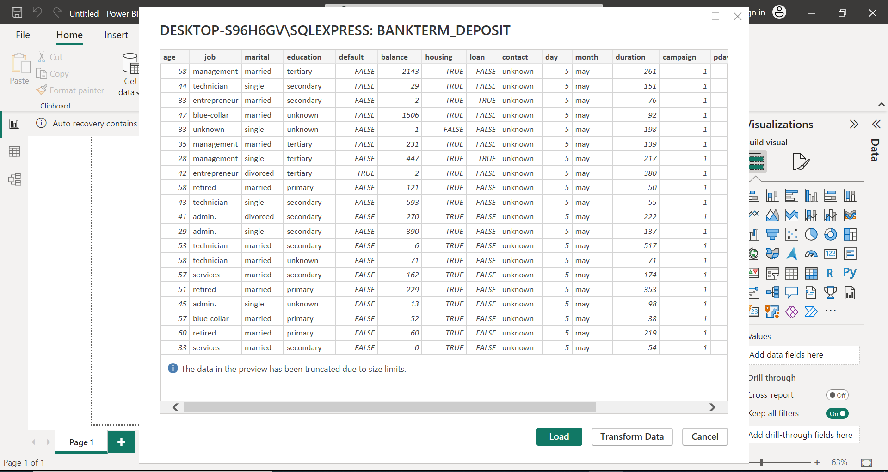

# POWER BI TASK 1 & 2

## INTRODUCTION

This repository includes two different tasks using Microsoft Power BI,
I tackled these two tasks by applying various steps using the Power Bi 
Query Editor offering a wide range of transformation, the primary 
objective was to gain valuable insights in Data cleaning and Data 
transformation. Importing the bank term dataset and 
extensively clean the Employee, Salary and Department Dataset.

## DATA SET

I was provided with 3 datasets to use for this task, these datasets 
consist of files in a comma seperated values (CSV) format. and they
each contain different quality feature

- Employee
- Salary
- Department

## TASKS

### TASK ONE

To import the 'bank term deposit subcription dataset into PowerBI using the CSV file option
- Open your Power BI desktop.
- To get data, click on TEXT/CSV to import the data into the desktop.
- Go to Data view to view your data in PowerBI desktop.
- In this have Data, we have 45211 rows in the banklist CSV dataset.

   |   

To load dataset into a database in sql server
- Create a database with the name Bankterm Deposit
- Use Bankterm Deposit database

  

- Import the CSV file data into the database VIA import flatfile
  thereby creating a table called banklist.
- Load the dataset into a dataset in SQL Server 

- Connect the Power Bi desktop to this database and import only the first 25 rows.

  | 

**_END OF TASK ONE_**

# TASK TWO

Extensively clean the Employee, Salary and Department provided.
Clean each column thorougly
edit headers,change datatype where neccesary, check column quality.

## EMPLOYEE TABLE
 

## SALARY TABLE

## DEPARTMENT TABLE

- Bringing the three datasets through the power query editor.

- Merging of the three datasets.

- A new table from the merged datasets "NEW EMPLOYEE"

**_THE END_**

